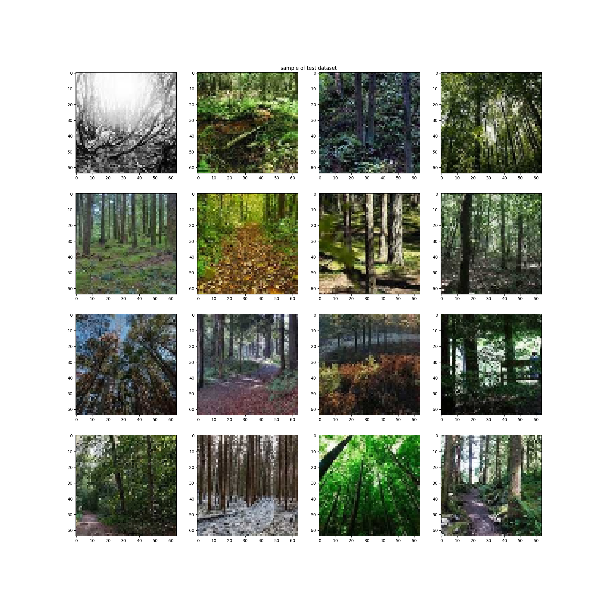

<<<<<<< HEAD
=======
---
title: Image Colorization
emoji: 🐢
colorFrom: purple
colorTo: yellow
sdk: docker
pinned: false
license: apache-2.0
app_port: 5000
---

hugging face config

>>>>>>> 9806df710f7850bef4ac174b66af98a07744ef4b
## Image Colorization
==============================

An deep learning based Image Colorization project.

## FINDINGS
- the task we want to learn is `image-colorization` but we can accompolish that by doing different types of tasks, I call these **sub-task**, in our content they could be like `regression based image colorization`, `classification(by binning) based colorization`, `GAN based colorization`, `image colorization + scene classication(Let there be colors research paper did this)`.
- based on analysis and while I was trying to come up with a project file structure I came to know that the data, model, loss, metrics, dataloader all these are very coupled while dealing with a particular task(`image-colorization`) but when we talk about a **sub-task** we have much more freedom.
- within a sub-task(e.g., regression-unet-learner) we already made a set of rules and now we can use different models without changing the data, or we can change different datasets while using the same model, **so it is important to fix the sub-task we want to do first.**
- so making a folder for each sub-task seems right as a sub-task has high cohesion and no coupling with any other sub-task.

## RULES
- use **lower_snake_case** for **functions**
- use **lower_snake_case** for **file_name & folder names**
- use **UpperCamelCase** for **class names**
- **sub-task** name should be in **lower-kebab-case**

## Project File Structure
------------
    .
    ├── LICENSE
    ├── README.md          <- The top-level README for developers using this project.
    ├── data/
    │   ├── external       <- Data from third party sources.
    │   ├── interim        <- Intermediate data that has been transformed.
    │   ├── processed      <- The final, canonical data sets for modeling.
    │   └── raw            <- The original, immutable data dump.
    ├── models/             <- Trained models
    ├── notebooks/          <- Jupyter notebooks
    ├── configs/
    │   ├── experiment1.yaml
    │   ├── experiment2.yaml
    │   ├── experiment3.yaml
    │   └── ...
    └── src/
        ├── sub_task_1/
        │   ├── validate_config.py
        │   ├── data/
        │   │   ├── register_datasets.py
        │   │   ├── datasets/
        │   │   │   ├── dataset1.py
        │   │   │   └── dataset2.py
        │   ├── model/
        │   │   ├── base_model_interface.py
        │   │   ├── register_models.py
        │   │   ├── models/
        │   │   │   ├── simple_model.py
        │   │   │   └── complex_model.py
        │   │   ├── losses.py
        │   │   ├── metrics.py
        │   │   ├── callbacks.py
        │   │   └── dataloader.py
        │   └── scripts/
        │       ├── create_dataset.py
        │       └── create_model.py
        ├── sub_task_2/
        │   └── ...
        ├── sub_task_3/
        │   └── ...
        ├── scripts/
        │   ├── create_sub_task.py
        │   ├── prepare_dataset.py
        │   ├── visualize_dataset.py
        │   ├── visualize_results.py
        │   ├── train.py
        │   ├── evaluate.py
        │   └── inference.py
        └── utils/
            ├── data_utils.py
            └── model_utils.py
--------

<small>Project based on the <a target="_blank" href="https://drivendata.github.io/cookiecutter-data-science/">cookiecutter data science project template</a>. #cookiecutterdatascience</small>

Kaggle API docs:- https://github.com/Kaggle/kaggle-api/blob/main/docs/README.md

## Kaggle Commands:-
- kaggle kernels pull anujpanthri/training-image-colorization-model -p kaggle/
- kaggle kernels push -p kaggle/
- echo "{\"username\":\"$KAGGLE_USERNAME\",\"key\":\"$KAGGLE_KEY\"}" > kaggle.json

## Docker Commands:-
- docker buildx build --secret id=COMET_API_KEY,env=COMET_API_KEY -t testcontainer
- docker run -it -p 5000:5000 -e COMET_API_KEY=$COMET_API_KEY testcontainer

## Git Commands:-
- git lfs migrate info --everything --include="*.zip,*.png,*.jpg"
- git lfs migrate import --everything --include="*.zip,*.png,*.jpg"

### Version 1:

- im gonna skip logging for now and rather use print statements

## Dataset

## Result

